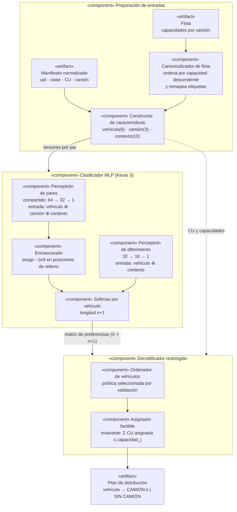
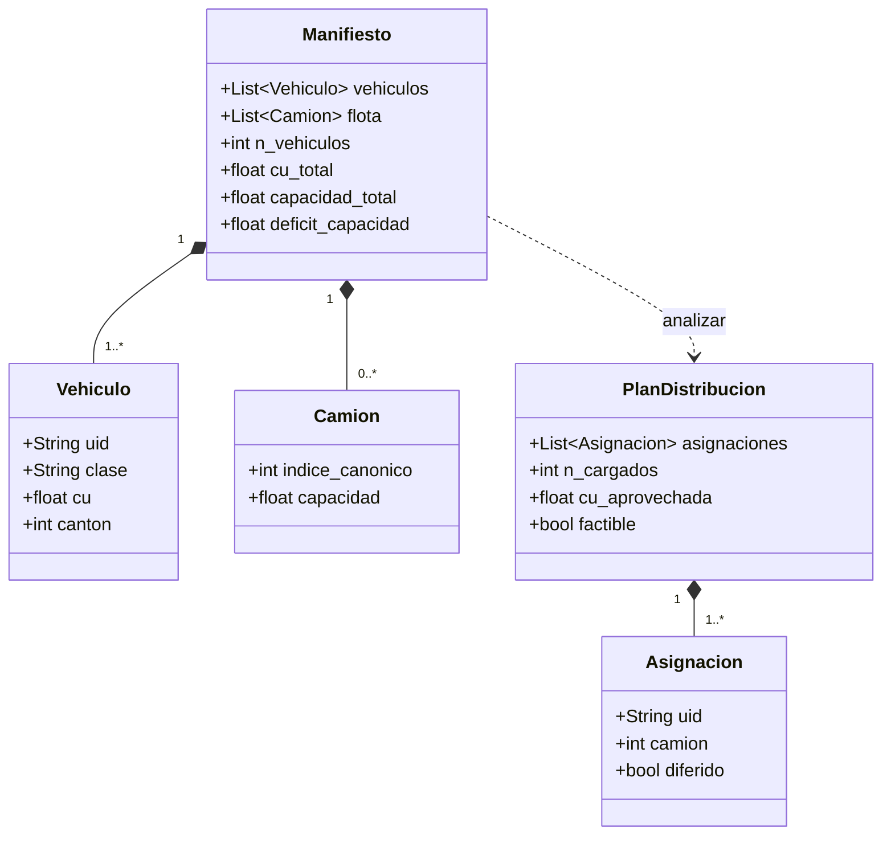

# Sección VI-D — Modelo de Multi-Layer Perceptron (MLP)

> **Entregable de Juan Francisco Fernández Ramos** (Planificación, pág. 6:
> *"Para una MLP Clasificador: definición de híper-parámetros, incluir la justificación
> del porqué se escogió dichos híper parámetros"*).
> Reemplaza el epígrafe vacío `D. Modelo de Multi-Layer Perceptron (MLP)` de la pág. 25.
>
> Todas las cifras citadas provienen de `artifacts/mlp/metrics.json`,
> `artifacts/mlp/training_report.json` y `artifacts/mlp/teacher_self_agreement.json`,
> generados por los scripts indicados al final. Ninguna es una proyección.

---

## 1. Arquitectura: puntuación compartida por par vehículo–camión

El requerimiento de la Fig. 1 define la salida como `CAMIÓN 1, CAMIÓN 2, …, CAMIÓN n`,
sin fijar *n*. Un perceptrón con una capa de salida `Dense(5)` — cuatro camiones más
`SIN CAMIÓN` — no satisface ese requerimiento: la cantidad de camiones quedaría escrita
en la arquitectura, y atender cinco camiones exigiría reconstruir la última capa y volver
a entrenar.

Por ello el clasificador implementado **no tiene una salida por camión**. Tiene un único
perceptrón multicapa que evalúa un par:

> ¿qué tan compatible es este vehículo con este camión, dado el manifiesto completo?

Formalmente, para el vehículo *i* y el camión *j* de un manifiesto con *n* camiones:

- s(i,j) = f(v_i, t_j, g) — un perceptrón compartido por todos los pares;
- s(i,∅) = h(v_i, g) — un segundo perceptrón para la decisión de diferir;

donde **v_i** son las características del vehículo, **t_j** las del camión, **g** el
contexto agregado del manifiesto, y ∅ representa `SIN CAMIÓN`. La distribución de
probabilidad de cada vehículo se obtiene aplicando softmax sobre los *n+1* candidatos:

    P(i → j) = exp(s(i,j)) / [ exp(s(i,∅)) + Σ_{k=1..n} exp(s(i,k)) ]

Como el mismo perceptrón *f* se aplica a todos los pares, **el número de parámetros no
depende de la cantidad de camiones**: el modelo entrenado tiene 4.482 parámetros tanto si
el manifiesto trae dos camiones como si trae cincuenta. Esa es la propiedad estructural
que distingue esta arquitectura de una de posiciones fijas, y es la que permite afirmar
que el diseño no impone un límite codificado a la flota.

Una segunda consecuencia es la equivarianza a permutación: si se reordenan los camiones
de entrada, las puntuaciones se reordenan de la misma forma. El modelo no aprende qué
significa la etiqueta `CAMIÓN 3`; aprende a juzgar por capacidad y contexto.

`SIN CAMIÓN` recibe una cabeza propia porque no es "un camión de capacidad cero", sino una
decisión de naturaleza distinta: depende del vehículo y del déficit agregado del
manifiesto, no de ningún camión en particular.

### Fig. VI-D-1. Diagrama de componentes de la solución preliminar



El decodificador no es un detalle de implementación: es un componente necesario del
diseño. El clasificador puntúa cada vehículo por separado y nada le impide preferir el
mismo camión para tres vehículos que juntos lo desbordan. La restricción
Σ CU ≤ capacidad acopla decisiones que el softmax trata como independientes. El
decodificador recorre los vehículos, prueba los camiones en el orden de preferencia del
modelo y asigna al primero donde el vehículo quepa; al terminar, **ningún camión excede su
capacidad**, con independencia de lo que haya predicho la red.

### Fig. VI-D-2. Contrato de datos entre componentes



---

## 2. Plataforma, lenguaje y librerías

| Componente | Versión | Justificación |
|---|---|---|
| Python | 3.12.13 | Es la versión que el resto del proyecto declara. Además, TensorFlow 2.21 sólo publica ruedas hasta CPython 3.13; el intérprete del sistema (3.14) no puede instalarlo, de modo que el entorno se fija explícitamente con `uv venv --python 3.12`. |
| Keras | 3.15.0 | Exigido por la planificación. La API funcional permite declarar el eje de camiones con dimensión dinámica, que es lo que hace posible la arquitectura de la sección 1. |
| TensorFlow | 2.21.0 | Backend de Keras 3. Se escoge frente a JAX o PyTorch por ser el menos disruptivo: el resto del proyecto no depende de ninguno de los tres, y TensorFlow es el backend por defecto de Keras. |
| NumPy | 2.5.1 | Construcción de los tensores por par y del enmascarado. |
| pandas · PyArrow | 2.3.3 · 25.0.0 | Lectura de los dos Parquet que produce `scripts/build_scenarios.py`. |
| scikit-learn | 1.9.0 | F1 macro y exactitud, como métricas secundarias de diagnóstico. |
| Matplotlib | 3.11.1 | Curvas de aprendizaje y matriz de confusión. |
| uv | — | Entorno y bloqueo de versiones en `uv.lock`, para que el experimento sea reproducible. |

---

## 3. Esquema de entradas y salida

Tres bloques de características, con 19 entradas para el perceptrón de pares y 16 para el
de diferimiento:

| Bloque | Dim. | Características |
|---|---|---|
| Vehículo | 6 | `cu`; codificación *one-hot* de la clase (AUTOMOVIL, CAMIONETA, JEEP, MOTOCICLETA); cantidad de vehículos de la misma clase en el manifiesto |
| Camión | 3 | `capacidad`; `capacidad / capacidad_total`; `capacidad / cu_total_del_manifiesto` |
| Contexto | 10 | `n_vehiculos`; `n_camiones`; `cu_total`; `capacidad_total`; `deficit_capacidad`; `ratio_utilizacion`; conteo de vehículos por cada una de las cuatro clases |

Las variables continuas se estandarizan con media y desviación calculadas **únicamente
sobre la partición de entrenamiento**; las columnas *one-hot* se dejan intactas. El
esquema se persiste en `artifacts/mlp/feature_schema.json` para que evaluación e
inferencia apliquen exactamente la misma transformación.

### Características deliberadamente excluidas

| Excluida | Razón |
|---|---|
| `uid`, `codigo_vehiculo` | Identificadores: sólo habilitan memorización. |
| Número del camión | Es la etiqueta arbitraria que la canonicalización elimina; reintroducirla como entrada revertiría la corrección. |
| Posición del vehículo dentro de su clase | El etiquetador reparte los cupos de cada clase con un barajado sembrado. Esa posición es ruido, no señal. |
| Rango del camión por capacidad | Tras canonicalizar es una función determinista de la capacidad, que el modelo ya recibe; incluirlo reintroduciría identidad de posición y degradaría la generalización a flotas mayores. |
| `canton` | El etiquetador exacto lo ignora: agrupa por clase y el cantón no participa en la restricción de capacidad. Se conserva en la salida y en el reporte, pero se excluye del modelo y queda para un experimento de ablación. |

**Salida.** Un vector de longitud *n+1* por vehículo. Por convención, el índice 0
corresponde a `SIN CAMIÓN` y los índices 1..*n* a los camiones en orden canónico. Situar
el diferimiento en la primera posición hace que el índice objetivo sea independiente del
relleno usado para agrupar manifiestos de distinto tamaño en un mismo lote.

---

## 4. Canonicalización de la flota: una corrección necesaria antes de entrenar

El generador de escenarios produce las capacidades en orden aleatorio y el etiquetador
exacto recorre los camiones por índice, llenando el primero tanto como puede. En
consecuencia, la etiqueta `CAMIÓN 1` no designa "el camión grande" sino "el que salió
primero del sorteo". El reparto de etiquetas resultante es degenerado.

Antes de construir las características, la flota se reordena por capacidad descendente y
las etiquetas se remapean en consecuencia. La asignación es la misma —sólo cambia el
nombre del camión—, pero el reparto de etiquetas mejora de forma sustancial sobre la
misma partición de entrenamiento (444.051 filas):

| Etiqueta | Orden original | Orden canónico |
|---|---:|---:|
| `SIN CAMIÓN` | 4,26 % | 4,26 % |
| `CAMIÓN 1` | 78,41 % | 52,29 % |
| `CAMIÓN 2` | 14,38 % | 25,33 % |
| `CAMIÓN 3` | 2,70 % | 13,16 % |
| `CAMIÓN 4` | 0,26 % | **4,97 %** |

La clase `CAMIÓN 4` pasa de estar prácticamente ausente a tener representación medible, y
la etiqueta se convierte en una función de una característica que el modelo sí observa.

**Alcance de esta corrección.** La canonicalización arregla el *nombre* del camión, no el
*plan*. El orden en que llega la flota también determina cuál de los óptimos empatados
devuelve la programación dinámica —con `[6,0 · 4,0]` llena el camión grande y con
`[4,0 · 6,0]` el chico, y ningún renombramiento lleva un plan al otro—, y eso la
canonicalización aguas abajo no lo toca. Corregirlo requiere ordenar la flota **antes** de
etiquetar, en el generador de escenarios, lo que obliga a regenerar el conjunto de datos y
reentrenar los cinco modelos del grupo; queda medido y declarado como limitación en la
sección 7, no aplicado.

---

## 5. Definición y justificación de los hiper-parámetros

Los valores se fijaron como configuración inicial y se contrastaron con una búsqueda
controlada sobre la partición de validación (2025). El criterio de selección fue la
**brecha de vehículos cargados frente al etiquetador exacto**, no la exactitud: el
objetivo primario del problema es cuántos vehículos se transportan, y la exactitud está
contaminada por el desempate arbitrario descrito en la sección 7.

### Arquitectura

| Hiper-parámetro | Valor | Justificación |
|---|---|---|
| Capas del perceptrón de pares | 64 → 32 → 1 | La relación a aprender es local y de baja dimensión: dado un vehículo, un camión y el estado agregado del manifiesto, decidir compatibilidad. Con 19 entradas, dos capas ocultas bastan para representar interacciones entre CU, capacidad y déficit. Una red más ancha añade capacidad sin señal que la sustente, porque el resto de la variabilidad de la etiqueta es ruido de desempate. |
| Capas del perceptrón de diferimiento | 32 → 16 → 1 | Decisión más simple y con menos entradas (16). Depende principalmente del déficit agregado, así que se le asigna menor capacidad que a la cabeza de pares. |
| Activación | ReLU | No satura para entradas positivas, evita el desvanecimiento del gradiente en redes densas y es el punto de partida estándar. Todas las características son numéricas y estandarizadas, sin necesidad de activaciones acotadas. |
| Última capa | Lineal (sin softmax) | La función de pérdida recibe `from_logits=True`; Keras aplica internamente la combinación numéricamente estable de softmax y entropía cruzada. Aplicar softmax en la capa y volver a exponenciarlo en la pérdida introduce error numérico. |
| Total de parámetros | **4.482** | Independiente de la cantidad de camiones, por construcción. |

### Regularización

| Hiper-parámetro | Valor | Justificación |
|---|---|---|
| Dropout | 0,20 tras cada capa oculta | Los episodios son semanas consecutivas del mismo cantón, muy parecidas entre sí. Sin regularización el modelo tiende a memorizar la identidad del episodio en lugar de la relación capacidad–CU. Un 20 % es intermedio: 0,10 regulariza poco para datos tan repetitivos y 0,30 empieza a impedir el ajuste de una red ya pequeña. |
| L2 sobre los pesos | 1e-4 | Las características agregadas del manifiesto están correlacionadas entre sí (`cu_total`, `deficit_capacidad` y `ratio_utilizacion` comparten información). La penalización L2 evita que el modelo compense esa correlación con pesos grandes de signo opuesto. |
| Decaimiento de pesos (AdamW) | 1e-4 | Complementa a la L2 desacoplando el decaimiento de la adaptación del gradiente. |

### Optimización

| Hiper-parámetro | Valor | Justificación |
|---|---|---|
| Optimizador | AdamW | Adapta la tasa por parámetro, útil porque las escalas de las características difieren (un conteo de clase frente a un ratio de utilización), y desacopla el decaimiento de pesos de la adaptación del gradiente, que es la corrección que AdamW aporta sobre Adam. |
| Tasa de aprendizaje inicial | 1e-3 | Valor estándar para AdamW. Con 1.735 pasos por época, converge en decenas de épocas sin oscilar. |
| Recorte de gradiente | norma 1,0 | El enmascarado introduce logits de −1e9 en las posiciones de relleno; el recorte acota el efecto de cualquier gradiente anómalo en los primeros pasos. |
| Tamaño de lote | 256 | Con 444.051 filas de entrenamiento da 1.735 pasos por época: suficiente ruido estocástico para escapar de mínimos pobres y suficiente estabilidad en la estimación del gradiente. |
| Épocas máximas | 100 | **Cota superior, no objetivo.** La corrida efectiva se detuvo en la época 56. |
| Parada temprana | paciencia 10, con restauración de los mejores pesos | Detiene el entrenamiento cuando la pérdida de validación deja de mejorar y devuelve los pesos de la mejor época (la 46), no los de la última. Sin la restauración se reportarían los pesos de un modelo ya deteriorado. |
| Reducción de la tasa | factor 0,5, paciencia 4 | Permite un ajuste más fino cuando la pérdida se estanca. En la corrida efectiva se activó cinco veces, desde 1e-3 hasta 3,9e-6. |
| Función de pérdida | Entropía cruzada categórica dispersa sobre logits | Las clases son mutuamente excluyentes: un vehículo va a exactamente un camión o queda diferido. La variante dispersa evita materializar la codificación *one-hot* del objetivo. |
| Ponderación de clase | **11,75** para `SIN CAMIÓN`, medida | La clase minoritaria representa el 4,26 % de la partición de entrenamiento (18.903 de 444.051 filas). El peso se calcula sobre esa partición, no se hereda: el valor 33 citado en la sección VI-A corresponde al reparto de otro modelo y sobreestima el desbalance real, que es de 22,6 a 1. |
| Semilla | 20260725 | Fijada con `keras.utils.set_random_seed` para que el experimento sea reproducible. |

### Resultado de la búsqueda

Se entrenaron y evaluaron ocho configuraciones (`scripts/sweep_mlp.py`), ordenadas por
brecha de conteo sobre validación:

| Configuración | Brecha de conteo | Brecha de CU | Parámetros | Épocas |
|---|---:|---:|---:|---:|
| `learning_rate = 3e-3` | +0,0275 | 0,0849 | 4.482 | 12 |
| `learning_rate = 3e-4` | +0,0288 | 0,0779 | 4.482 | 50 |
| `batch_size = 512` | +0,0290 | 0,0767 | 4.482 | 42 |
| `dropout = 0,30` | +0,0298 | 0,0788 | 4.482 | 37 |
| capas 128-64-32, `dropout` 0,10, `lr` 3e-4 | +0,0300 | 0,0758 | 14.018 | 82 |
| **configuración adoptada** | +0,0303 | 0,0779 | 4.482 | 56 |
| `dropout = 0,10` | +0,0305 | 0,0767 | 4.482 | 43 |
| capas 128-64-32 | +0,0315 | 0,0792 | 16.130 | 60 |

**Las ocho configuraciones caen dentro de ±0,004.** Antes de adoptar la mejor se comprobó
si esa diferencia es real: contrastando la configuración adoptada contra la primera del
ranking sobre los mismos 4.030 episodios, la diferencia emparejada es +0,0027 con un error
estándar de 0,0018 (t = 1,51), y ambos modelos discrepan en **47 de 4.030 episodios**. La
diferencia no es estadísticamente significativa al 95 %.

Por eso **se conserva la configuración inicial**. Adoptar la primera del ranking sería
ajustar el modelo al ruido del conjunto de validación, y además empeora la brecha de CU
(0,0849 frente a 0,0779), que ya es la métrica más débil. Duplicar o triplicar los
parámetros tampoco ayuda: las dos variantes anchas quedan en la mitad inferior de la tabla.

Este resultado es en sí mismo informativo: dentro de este rango, el factor limitante no son
los hiper-parámetros sino la señal disponible en la etiqueta, cuantificada en la sección 7.

---

## 6. Partición de los datos

Los vehículos de un mismo episodio comparten flota, manifiesto y contexto agregado.
Repartir filas individualmente entre entrenamiento y prueba colocaría casi la misma
información a ambos lados y produciría métricas infladas. La partición es **temporal y por
episodio completo**:

| Partición | Años | Episodios | Filas | Diferidos |
|---|---|---:|---:|---:|
| Entrenamiento | 2018–2024 | 29.278 | 444.051 | 4,26 % |
| Validación | 2025 | 4.030 | 66.399 | 4,14 % |
| Prueba | 2026 | 1.531 | 24.230 | 4,13 % |

El año 2017 no aparece porque ese archivo del SRI no contiene la columna `FECHA PROCESO` y
el pipeline de características lo descarta; la cobertura efectiva del conjunto es
2018–2026. Una verificación automática aborta la ejecución si un episodio llegara a
aparecer en dos particiones.

---

## 7. Limitaciones declaradas

Se enuncian de forma explícita para no atribuir al diseño propiedades que no se midieron.

1. **La etiqueta es sólo parcialmente predecible, y la causa está identificada.**
   Presentando al etiquetador exacto la misma flota en distinto orden —una situación
   operativamente idéntica— reproduce apenas el 39,83 % de sus propias etiquetas, mientras
   que el resultado operativo (vehículos cargados y CU aprovechada) es idéntico. Ahora
   bien, esa cifra **no es el techo**: el techo exacto, derivado de que dos vehículos de la
   misma clase tienen características idénticas, es **0,9243** sobre la partición de
   prueba, y el modelo alcanza el 58,8 % de él. La brecha restante procede del orden
   aleatorio de la flota, que no es una entrada observable; fijándolo antes de etiquetar,
   el mismo modelo alcanza 0,8458 de exactitud y 0,8131 de F1 macro. El ruido
   verdaderamente irreducible vale unos 8 puntos. Por eso la exactitud se reporta como
   diagnóstico secundario y **siempre acompañada de su techo**.

2. **El conjunto de datos hereda una arbitrariedad corregible que no se corrigió.** El
   generador de escenarios sortea las capacidades sin ordenarlas, y eso determina cuál de
   los planes óptimos empatados devuelve el etiquetador. Está medido lo que cuesta y lo que
   se gana (sección 4 y `docs/tarea4/06_canonicalizacion_y_etiquetado.md`); no se aplicó
   porque obliga a regenerar el conjunto y reentrenar los cinco modelos del grupo, decisión
   que no corresponde a este entregable.

3. **La generalización a flotas mayores está demostrada como factibilidad, no como
   calidad.** Los datos de entrenamiento contienen entre uno y cuatro camiones. El modelo
   guardado acepta y resuelve manifiestos de hasta diez camiones con los mismos pesos y
   sin violar capacidad, pero los conjuntos de extrapolación construidos resultaron poco
   exigentes; la sección VII detalla el alcance de esa evidencia.

4. **El decodificador es heurístico.** Garantiza factibilidad, no optimalidad. La distancia
   respecto al óptimo se mide contra el etiquetador exacto y se reporta como brecha.

5. **El escenario es sintético.** Los registros del SRI son matriculaciones, no manifiestos
   de transporte, y las flotas se generan aleatoriamente. Las conclusiones se refieren a
   la capacidad del modelo de imitar al etiquetador exacto, no a operaciones reales.

---

## 8. Reproducibilidad

```bash
git lfs pull                                        # datos reales (522 MB)
uv venv --python 3.12 && uv sync                    # Keras 3.15 + TensorFlow 2.21
uv run python scripts/build_vehicle_features.py     # 2.491.511 vehículos en alcance
uv run python scripts/build_scenarios.py            # 34.839 episodios, 534.680 filas
uv run python scripts/train_mlp.py                  # artifacts/mlp/
uv run python scripts/evaluate_mlp.py               # artifacts/mlp/metrics.json
uv run python scripts/teacher_self_agreement.py --years 2026
uv run pytest tests/modeling                        # 80 pruebas
```

Artefactos persistidos en `artifacts/mlp/`: `model.keras`, `feature_schema.json`,
`label_mapping.json`, `metrics.json`, `training_report.json`, `training_history.csv`,
`model_summary.txt`, `learning_curves.png`, `confusion_matrix.png`.
